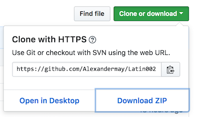

# Latin 0002 Project
A valid and well-formed epiDoc xml transformed into an interactive web-page.  For transcription and translation, each word is a link. 

**Requirements**
* Chrome or Firefox web browser (Not tested on IE, so it probably won't work, and also, you shouldn't be using IE)
* XML editor (oXygen is suggested.)

Clone the repo, or download a zip

1. If you are cloning the repo, make sure you have [Git installed](https://gist.github.com/derhuerst/1b15ff4652a867391f03)

         $  git clone https://github.com/Alexandermay/Latin002.git
 
 
2. If you don’t have Git, you can always chose the Download the zip option.
 
       
3. Double click on  HD033176.html